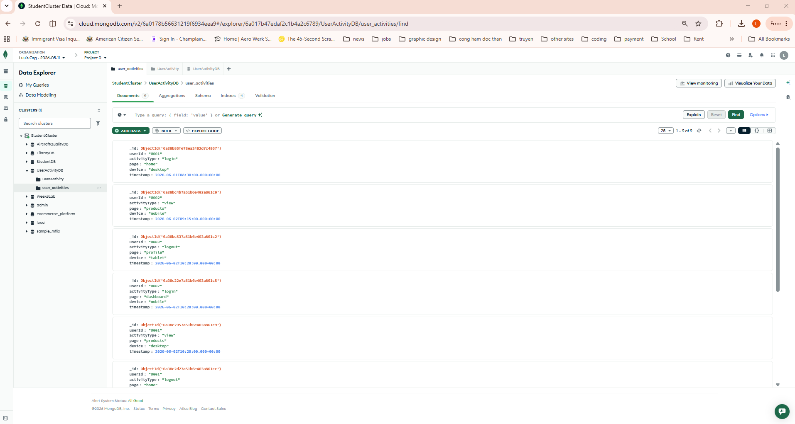
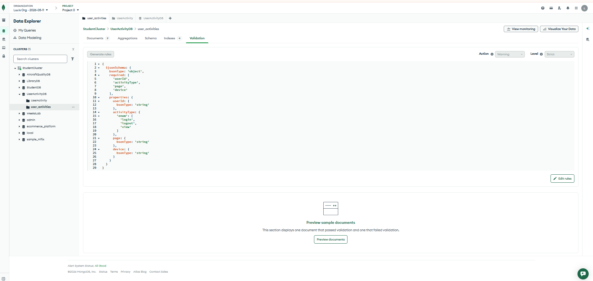
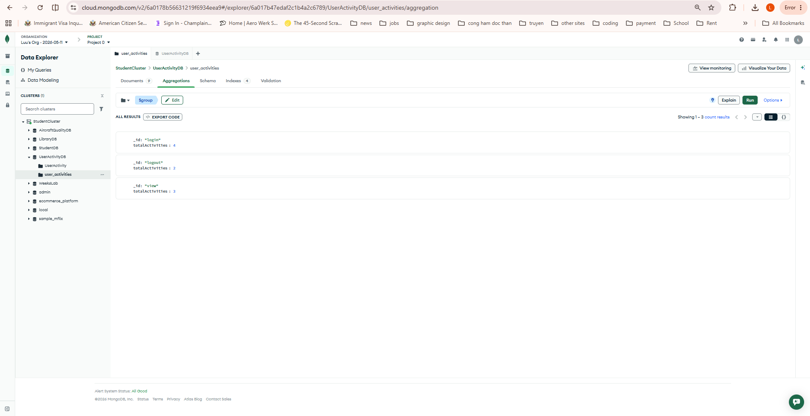

# MongoDB User Activity Tracking Project

## Overview
This project demonstrates the implementation of a MongoDB-based user activity tracking system.

## Features
- CRUD Operations
- Validation Rules
- Indexing
- Aggregation Pipelines
- Activity Reporting

## Technologies
- MongoDB Atlas
- MongoDB Query Language
- GitHub

## Screenshots

### Documents Collection

### Validation Rules

### Activity Type Report

